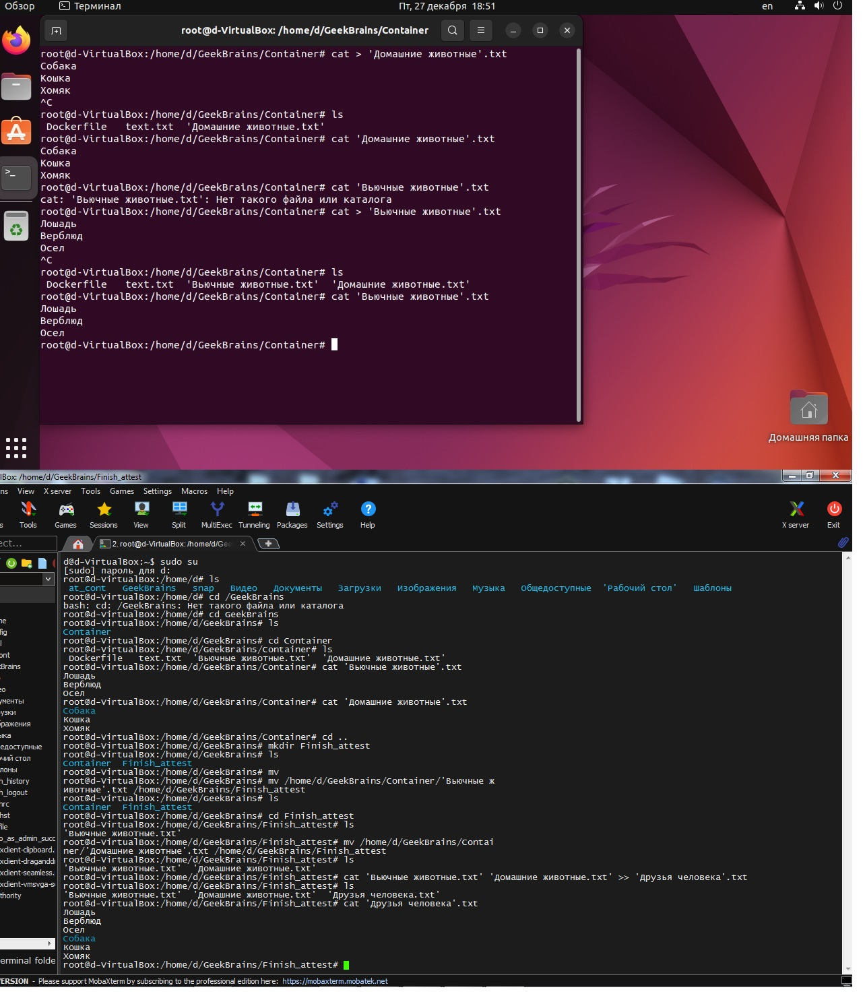
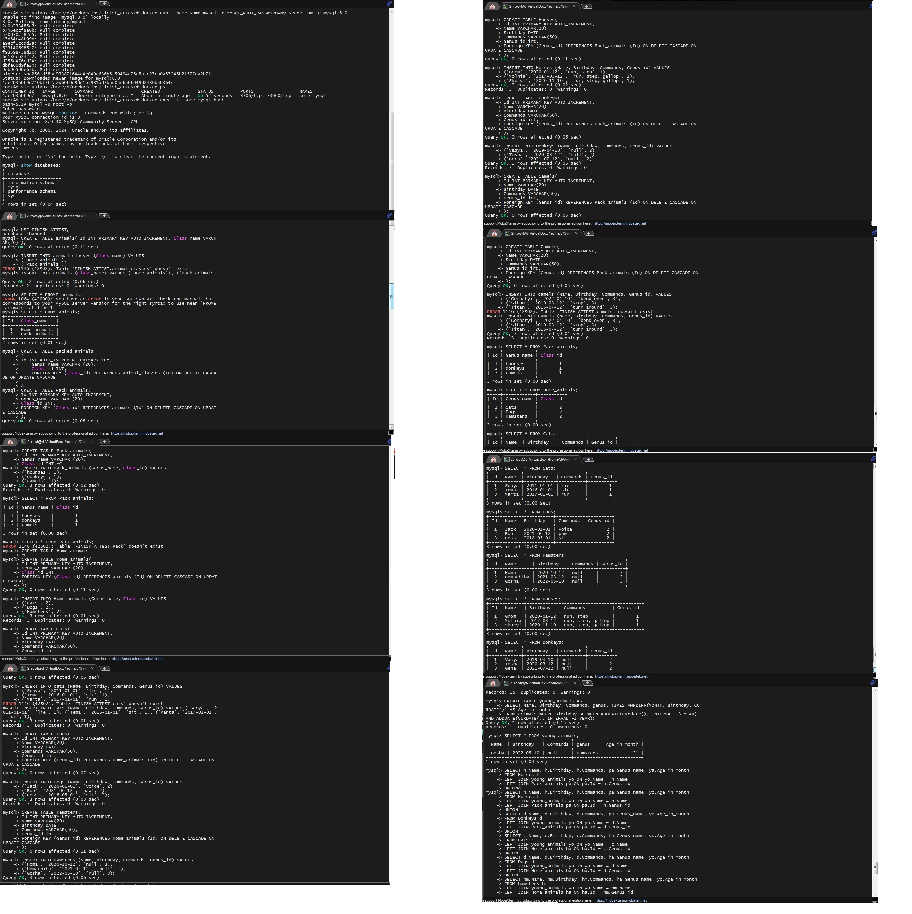
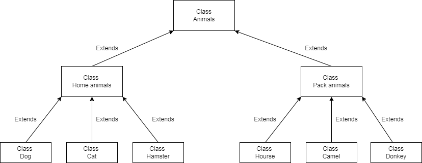

# **Final_Certification_2nd_Quater**

## *Информация о проекте* 
## *Необходимо организовать систему учета для питомника в котором*  *живут домашние и вьючные животные.*

## Linux_SQL_Java_Project

Для сдачи проекта необходимо создать отдельный общедоступный
репозиторий(Github, gitlub, или Bitbucket). Разработку вести в этом
репозитории, использовать пул реквесты на изменения. Программа должна запускаться и работать, ошибок при выполнении программы быть не должно. Программа, может использоваться в различных системах, поэтому необходимо разработать класс в виде конструктора

### Работа в Linux через VirtualBox
[Terminal_Linux_Command](Linux_Terminal.txt)

### Работа с datbase MYSQL в Linux
Сделал соединение в MobaXterm по ssh ключу c виртуальной машиной Ubuntu, запустил контейнер с MYSQL и создал базу данных с животными
[Terminal_Linux_Command2](MYSQL_DB.txt)

Нарисовал диаграмму, в которой есть класс родительский класс, домашние животные и вьючные животные, в состав домашних животных вошли классы: собаки, кошки, хомяки, а в класс вьючные животные
вошли: лошади, верблюды и ослы.

### Работа с Java
Приступил к финальной части задания на Java